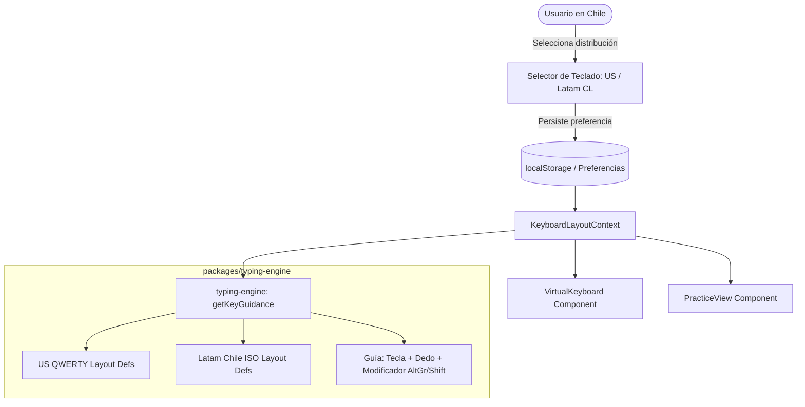

# Plan de Implementación: Soporte para Teclado Latinoamericano (Chile) vs. US QWERTY

> **Objetivo:** Permitir al usuario alternar dinámicamente entre la distribución **US QWERTY (ANSI)** y **Español Latinoamericano (ISO / Chile)**, adaptando la representación visual del teclado virtual, las guías de digitación (dedos asignados), los atajos de modificadores (`AltGr` y `Shift`) y el manejo de caracteres especiales de programación.

---

## 1. Análisis Técnico de Distribuciones

En programación, la diferencia entre **US QWERTY** y **Latinoamérica (Chile)** es radical en la ubicación de los símbolos más frecuentes:

| Carácter                    | US QWERTY (ANSI)                      | Español Latinoamericano (Chile - ISO)                                                        | Dedo sugerido en Latam                  |
| :-------------------------- | :------------------------------------ | :------------------------------------------------------------------------------------------- | :-------------------------------------- |
| **`ñ` / `Ñ`**               | _No existe en teclado base_           | Tecla dedicada a la derecha de la `L`                                                        | Meñique derecho                         |
| **`;` (Punto y coma)**      | Tecla directa a la derecha de la `L`  | `Shift + ,`                                                                                  | Anular izq. (Shift) + Medio der. (`,`)  |
| **`:` (Dos puntos)**        | `Shift + ;`                           | `Shift + .`                                                                                  | Anular izq. (Shift) + Anular der. (`.`) |
| **`{` (Llave apertura)**    | `Shift + [`                           | `AltGr + '` (o tecla al lado de la `P`)                                                      | Meñique der.                            |
| **`}` (Llave cierre)**      | `Shift + ]`                           | `AltGr + ¿` (o tecla al lado de `{`)                                                         | Meñique der.                            |
| **`[` (Corchete apertura)** | Tecla directa al lado de la `P`       | `AltGr + 8` (o tecla al lado de la `P`)                                                      | Pulgar/Meñique der.                     |
| **`]` (Corchete cierre)**   | Tecla directa                         | `AltGr + 9`                                                                                  | Pulgar/Meñique der.                     |
| **`(` y `)`**               | `Shift + 9` / `Shift + 0`             | `Shift + 8` / `Shift + 9`                                                                    | Anular/Meñique der.                     |
| **`=` (Signo igual)**       | Tecla directa al lado del `0`         | `Shift + 0`                                                                                  | Meñique der.                            |
| **`/` (Slash)**             | Tecla directa al lado de `Shift` der. | `Shift + 7`                                                                                  | Índice der.                             |
| **`\` (Backslash)**         | Tecla dedicada sobre `Enter`          | `AltGr + ?` o tecla `\|°`                                                                    | Meñique izq. / der.                     |
| **`\|` (Pipe)**             | `Shift + \`                           | Tecla directa a la izq. del `1` (`\| ° ¬`)                                                   | Meñique izq.                            |
| **`@` (Arroba)**            | `Shift + 2`                           | `AltGr + Q` (estándar Windows Latam) o `AltGr + 2`                                           | Meñique izq.                            |
| **`<` y `>`**               | `Shift + ,` y `Shift + .`             | Tecla física ISO a la izq. de la `Z` (`IntlBackslash`)                                       | Meñique izq.                            |
| **Backtick (`` ` ``)**      | Tecla directa a la izq. del `1`       | Tecla con acento grave (suele requerir doble pulsación o espacio si actúa como tecla muerta) | Meñique/Anular der.                     |

---

## 2. Arquitectura de la Solución



---

## 3. Fases del Plan de Implementación

### Fase 1: Paquete Compartido (`packages/shared`)

1. **Definir el enum de distribuciones soportadas:**
   ```ts
   export const KEYBOARD_LAYOUTS = ["us", "latam"] as const;
   export type KeyboardLayout = (typeof KEYBOARD_LAYOUTS)[number];
   export const DEFAULT_KEYBOARD_LAYOUT: KeyboardLayout = "latam";
   ```
2. **Extender el esquema de perfil de usuario** para persistir la preferencia en la base de datos (columna opcional `keyboard_layout` en tabla `users`).

### Fase 2: Motor de Mecanografía (`packages/typing-engine`)

1. **Modelar la distribución física de Chile / Latinoamérica (`LATAM_KEYBOARD_ROWS`):**
   - **Fila de números:** `[ | ° ¬ ] [ 1 ! ] [ 2 " ] [ 3 # ] [ 4 $ ] [ 5 % ] [ 6 & ] [ 7 / ] [ 8 ( ] [ 9 ) ] [ 0 = ] [ ' ? ] [ ¿ ¡ ] [ Backspace ]`
   - **Fila superior:** `[ Tab ] [ Q @ ] [ W ] [ E ] [ R ] [ T ] [ Y ] [ U ] [ I ] [ O ] [ P ] [ ´ ¨ ] [ * + ~ ]`
   - **Fila central (Home Row):** `[ Caps ] [ A ] [ S ] [ D ] [ F ] [ G ] [ H ] [ J ] [ K ] [ L ] [ Ñ ] [ { [ ] [ } ] ] [ Enter ISO ]`
   - **Fila inferior:** `[ Shift ] [ < > ] [ Z ] [ X ] [ C ] [ V ] [ B ] [ N ] [ M ] [ ; , ] [ : . ] [ _ - ] [ Shift ]`
   - **Fila espaciadora:** `[ Ctrl ] [ Win ] [ Alt ] [ Barra Espaciadora ] [ AltGr ] [ Ctrl ]`
2. **Actualizar `getKeyGuidance(char, layout)`:**
   - Si `layout === "latam"`, indicar la tecla física correspondiente y si requiere `AltGr` (ej.: para `@` señalar `KeyQ` con bandera `altGrRequired: true`).
   - Mostrar el texto de ayuda localizado: _"Presiona AltGr + Q con el meñique izquierdo"_.
3. **Manejo de teclas muertas (Dead Keys):**
   - En navegadores bajo Windows en español, pulsar acento grave o circunflejo emite un evento `e.key === "Dead"`.
   - Implementar en `session.ts` la normalización para que si el carácter objetivo es `` ` `` o `^`, una pulsación simple o compuesta sea validada naturalmente.
4. **Tests unitarios exhaustivos con Vitest:**
   - Probar que `{` en `us` reporte `Shift + [` y en `latam` reporte `AltGr + '`.
   - Probar la existencia de la tecla `ñ` y su dedo asignado (meñique derecho).
   - Probar símbolos numéricos (`/`, `=`, `(`, `)`).

### Fase 3: Componentes de Interfaz en `apps/web`

1. **Componente selector de distribución (`KeyboardLayoutSelector`):**
   - Toggle elegante con banderas e íconos: `🇺🇸 US QWERTY` y `🇨🇱 Latam (Chile)`.
   - Accesible tanto en la barra de navegación superior como en la barra de herramientas de la pantalla de práctica.
2. **Contexto de React (`KeyboardLayoutContext`):**
   - Guarda la selección en `localStorage` para recordar la preferencia en futuras visitas.
   - Sincroniza automáticamente la distribución activa en todos los componentes.
3. **Actualización de `VirtualKeyboard`:**
   - Renderizar dinámicamente las filas según el layout seleccionado (`US_KEYBOARD_ROWS` o `LATAM_KEYBOARD_ROWS`).
   - Resaltar la tecla física real (ej. resaltar `KeyQ` + `AltRight` cuando toque teclear `@` en modo Latam).
4. **Actualización de la pantalla de práctica (`PracticeView`):**
   - Pasar el layout seleccionado a `handleKeystroke` y a `getKeyGuidance`.

### Fase 4: Pruebas y Validación

1. **Pruebas en navegador:**
   - Probar con teclado físico latinoamericano en Chile en ejercicios de nivel 2 (delimitadores `{ } [ ] < >`) y nivel 4 (código real con `async`, `=>`, `;`).
   - Alternar entre US y Latam en caliente sin recargar la página.
2. **Pruebas automatizadas:**
   - Suite de Vitest en `packages/typing-engine` con cobertura completa para ambas distribuciones.
